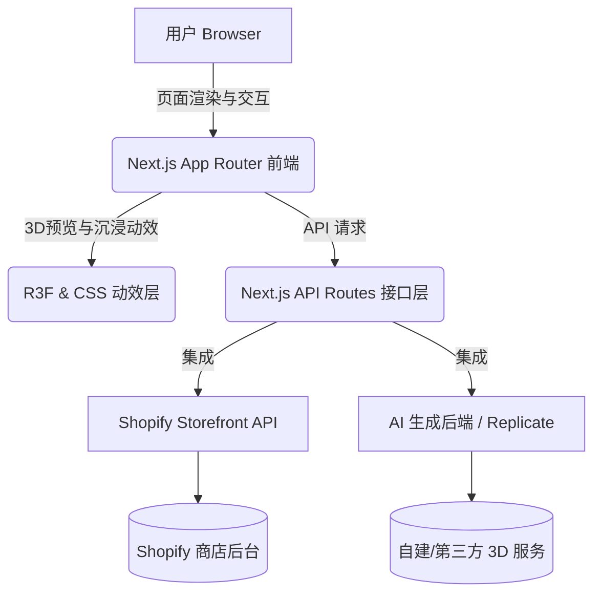

# 核心项目世界观 (Project Overview)

## 1. 项目愿景与定位
本项目是一个支持用户上传 2D 图片，并通过 AI 技术转化为 3D 模型风格渲染，最终支持物理下单 3D 打印实体手办的 **电子商务定制独立站**。
系统需兼具极致的现代化视觉体验（支持多重沉浸式前端主题）与稳定快速的电商结账体验（接入 Shopify）。

## 2. 宏观架构 (Architecture)
系统采用前后端分离但高度聚集在 Next.js 框架内的架构设计：

## 3. 技术核心选型 (Tech Stack)

### 3.1 表现层 (Frontend)
- **核心框架**: **Next.js 14** (App Router 模式) - 用于提供极速的 Server-Side Rendering (SSR) 及优化的 SEO。
- **UI 样式**: **Tailwind CSS** 结合原生高度定制的 CSS Keyframes 动效，构建无拘无束的定制化多主题系统。可选引入 `shadcn/ui` 作为基础无头组件库。
- **3D 表现**: **React Three Fiber (R3F)** (初期可先采用静态 Image Slider 对比图，后续演进为全 3D 渲染器预览)。
- **状态追踪**: **Zustand** - 轻量的客户端购物车和主题状态维护者。
- **表单效验**: **React Hook Form**。

### 3.2 服务层 (Backend API)
- **网关角色**: **Next.js API Routes** - 扮演与第三方厂商间隔离密钥的 Bff (Backend for Frontend)。不受阻于跨域。

### 3.3 外部设施层 (Infrastructures)
- **部署宿主**: **Vercel** - 利用 Vercel Global Edge Network，天然适配 Next.js 提供极快全球访问的 CDN。
- **电商基石**: **Shopify** - 提供底层购物车持久化、商品模型数据、多币种结账能力 `@shopify/shopify-api`。
- **AI 生图**: 待接入 Replicate、Stability AI 或自研定制微型模型服务。
