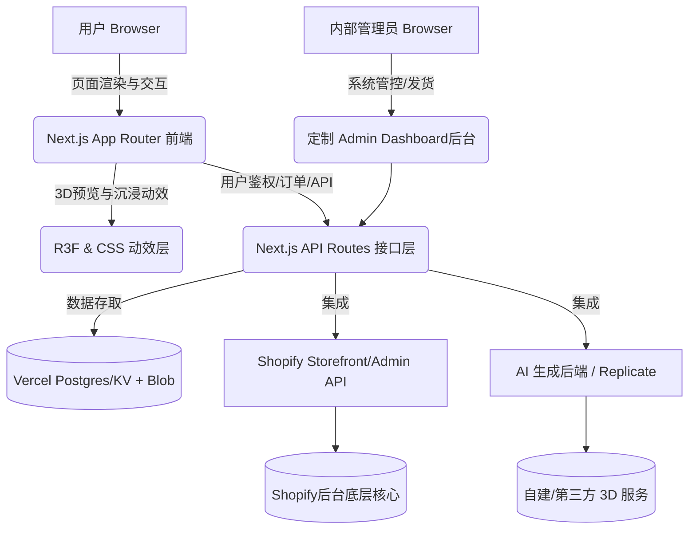

# 核心项目世界观 (Project Overview)

## 1. 项目愿景与定位
本项目是一个支持用户上传 2D 图片，并通过 AI 技术转化为 3D 模型风格渲染，最终支持物理下单 3D 打印实体手办的 **电子商务定制独立站**。
系统需兼具极致的现代化视觉体验（支持多重沉浸式前端主题）与稳定快速的电商结账体验（接入 Shopify）。

## 2. 宏观架构 (Architecture)
系统采用前后端分离但高度聚集在 Next.js 框架内的架构设计：

## 3. 技术核心选型 (Tech Stack)

### 3.1 表现层 (Frontend)
- **核心框架**: **Next.js 14** (App Router 模式) - 用于提供极速的 Server-Side Rendering (SSR) 及优化的 SEO。
- **UI 样式**: **Tailwind CSS** 结合原生高度定制的 CSS Keyframes 动效，构建无拘无束的定制化多主题系统。可选引入 `shadcn/ui` 作为基础无头组件库。
- **3D 表现**: **React Three Fiber (R3F)** (初期可先采用静态 Image Slider 对比图，后续演进为全 3D 渲染器预览)。
- **状态追踪**: **Zustand** - 轻量的客户端购物车和主题状态维护者。
- **表单效验**: **React Hook Form**。

### 3.2 服务层 (Backend API)
- **网关角色**: **Next.js API Routes** - 扮演与第三方厂商间隔离密钥的 Bff (Backend for Frontend)。不受阻于跨域。
- **数据流转**: 处理订单同步、Webhooks、以及连接 AI 工作流的长轮询架构。
- **自研简易后台**: 基于 Next.js 提供 /admin 私有化路由管控订单审核与物流回传。

### 3.3 外部设施层 (Infrastructures)
- **部署宿主**: **Vercel** - 天然适配 Next.js 提供极快全球访问的 CDN。
- **账户体系与数据库**: 拟采用 NextAuth.js (Auth.js) 搭配 Vercel Postgres/KV 管理独立站自有会员账号（记录生成历史、游离于 Shopify 的多重信息）。
- **图片云存储**: **Vercel Blob** - 用于沉淀用户上传的原图与 AI 产出的资产。
- **电商基石**: **Shopify** - 提供底层购物车持久化、商品模型数据、多币种结账能力 (`@shopify/shopify-api`)。
- **AI 生图**: 接入 Replicate、Stability AI 或自研定制微型模型服务。

---

## 4. 故障排查与已知问题记录 (Troubleshooting & Known Issues)

### 4.1 本地开发环境: 数据库连接失败 (Error: Can't reach database server at localhost:5432)
**问题描述**：在本地开发时访问需要读取数据库的页面 (例如 `/profile`)，偶尔会遇到 Prisma 报错 `Invalid prisma.xxxx.findMany() invocation: Can't reach database server at localhost:5432`。此问题通常在电脑重启后首次启动项目时出现。
**根本原因**：项目的本地 PostgreSQL 数据库运行在 Docker 容器 (`figurine_postgres`) 中。电脑意外关机或重启后，Docker 桌面端 (Docker Desktop) 可能未随系统自启，或者即使自启，该 Postgres 容器状态也未恢复为 Running。
**解决规范与流程**：
1. **启动 Docker 引擎**：确保 Windows/Mac 上的 Docker Desktop 已启动并处于 `Engine running` 状态。
2. **拉起数据库容器**：在项目根目录运行 `docker-compose up -d` 重新启动数据库服务。
3. **确认连通性**：运行 `docker ps`，确认名为 `figurine_postgres` 的容器成功在 `5432` 端口运行。
4. **重启 Web 服务**：重新启动 Next.js 本地开发服务器 (`npm run dev`)。
*(注：如果启动容器后 Prisma 仍然报错 EPERM 或 EBUSY，通常是因为 Web 服务占据了 Prisma 生成引擎的文件锁，先关掉 Web 服务，跑一次 `docker-compose up -d` 确认绿灯，再重新 `npm run dev` 即可恢复。)*
